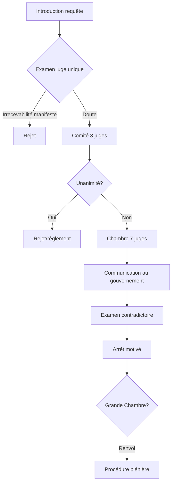

Approche systémique d'une juridiction internationale unique_

## **I. Genèse et évolution historique**

1. **Fondements conventionnels**
    
    - **Article 19 CEDH** : Création d'une juridiction permanente (réforme du Protocole 11, entré en vigueur le 1/11/1998).
        
    - **Protocole 14** (2010) : Introduction de nouveaux critères de recevabilité (art. 12) et du mécanisme de jugement unique.
        
2. **Chronologie clé**
    
    - **1959** : Première formation de la Cour
        
    - **1998** : Fin de la Commission européenne des droits de l'homme
        
    - **2022** : Exclusion de la Russie (résolution CM/Res(2022)2)
        

## **II. Architecture institutionnelle détaillée**

## **A. Composition et statut des juges**

- **47 juges** (art. 20 CEDH) :
    
    - Élection par l'Assemblée parlementaire (liste tripartite des États)
        
    - Mandat de **9 ans non renouvelable** (art. 23 §1)
        
    - Critères d'indépendance : Interdiction des activités incompatibles (art. 21 §3)
        
- **Organigramme hiérarchique** :
    
    - **Président de la Cour** : Direction administrative et représentation
        
    - **Sections** : 5 formations permanentes (art. 25 b))
        
    - **Greffe** : 700 juristes (dont 70 référendaires)
        

## **B. Formations juridictionnelles**

| Formation          | Composition | Compétences                        | Base légale |
| ------------------ | ----------- | ---------------------------------- | ----------- |
| **Juge unique**    | 1 juge      | Filtrage des requêtes irrecevables | Art. 27     |
| **Comité**         | 3 juges     | Rejet unanime ou règlement amiable | Art. 28     |
| **Chambre**        | 7 juges     | Jugement au fond + interprétation  | Art. 29     |
| **Grande Chambre** | 17 juges    | Affaires complexes + renvois       | Art. 30     |

**Processus de renvoi** : Droit de dessaisissement exceptionnel (art. 30 CEDH) sur demande partie dans les **3 mois** post-arrêt.

## **III. Mécanismes procéduraux exhaustifs**

## **A. Typologie des requêtes**

1. **Requêtes individuelles** (art. 34) :
    
    - Conditions de recevabilité (art. 35) :
        
        - Épuisement des voies de recours internes
            
        - Délai de **6 mois** après décision finale nationale
            
        - Préjudice personnel et direct
            
2. **Requêtes interétatiques** (art. 33) :
    
    - Exemple : _Chypre c. Turquie_ (2014) sur occupation nord-chypriote
        

## **B. Procédure détaillée**

## **C. Recours exceptionnels**

1. **Interprétation des arrêts** (Règlement art. 79) :
    
    - Délai : **1 an** post-arrêt
        
    - Limite : Clarification du dispositif, pas de révision
        
    - Exemple : _Mamatkulov c. Turquie_ (interprétation des mesures provisoires)
        
2. **Révision** (Règlement art. 80) :
    
    - Conditions strictes : Découverte de faits décisifs inconnus
        

## **IV. Doctrines jurisprudentielles structurantes**

## **A. Principes directeurs**

1. **Marge d'appréciation nationale** :
    
    - Théorie développée dans _Handyside c. RU_ (1976)
        
    - Gradation selon le droit concerné :
        
        - Étroite pour les droits absolus (art. 3)
            
        - Large pour les droits relatifs (art. 10)
            
2. **Obligations positives** :
    
    - _Osman c. RU_ (1998) : Devoir de protéger les citoyens
        
3. **Effet horizontal** :
    
    - _Von Hannover c. Allemagne_ (2004) : Application indirecte aux relations privées
        

## **B. Méthodologie interprétative**

- **Instrument vivant** (art. 32 VCLT) : Actualisation téléologique
    
- **Proportionalité stricte** : Test en 4 étapes (_SAS c. France_) :
    
    1. Base légale
        
    2. But légitime
        
    3. Nécessité démocratique
        
    4. Balance intérêts
        

## **V. Exécution des arrêts : mécanisme complet**

## **A. Rôle du Comité des Ministres**

- Procédures de surveillance (art. 46 §2) :
    
    - **Standard** : Résolutions intérimaires
        
    - **Renforcée** : Procédures d'infraction (ex. _Ilascu c. Moldavie_)
        

## **B. Mesures individuelles et générales**

- **Restitutio in integrum** : Priorité à la réparation en nature
    
- **Satisfaction équitable** : Plafond de 1M€ (art. 41)
    
- **Arrêts pilotes** : Réforme systémique (_Broniowski c. Pologne_)
    

## **VI. Défis contemporains analysés**

## **A. Crise de légitimité**

- **Critiques récurrentes** :
    
    - "Gouvernement des juges" (thèse de F. Sudre)
        
    - Conflit avec les Cours constitutionnelles (_Taricco II CJUE_)
        

## **B. Statistiques 2023**

| Donnée               | Valeur |
| -------------------- | ------ |
| Requêtes pendantes   | 74 650 |
| Arrêts rendus        | 1 223  |
| Taux de condamnation | 84%    |

## **C. Innovations procédurales**

- **Protocole 16** (2018) : Avis consultatifs pour les Cours suprêmes
    
- **Digitalisation** : Plateforme HUDOC EX pour requêtes électroniques
    

## **VII. Étude de cas : Jurisprudence sélectionnée**

1. **Droit à la vie (art. 2)** :
    
    - _Lopes de Sousa Fernandes c. Portugal_ (2017) : Obligation de régulation médicale
        
2. **Interdiction de la torture (art. 3)** :
	    droit intengible,
    - _Jalloh c. Allemagne_ (2006) : Preuve obtenue sous contrainte
        
3. **Nouvelles technologies** :
    
    - _Big Brother Watch c. RU_ (2021) : Surveillance de masse et proportionnalité
    	
4. Interdiction escalvage, travail forcé (Article 4) 

## **VIII. Perspectives critiques**

- **Théorie du dialogue des juges** (A. Spielmann) : Interaction avec la CJUE
    
- **Scénarios d'évolution** :
    
    - Option 1 : Restriction aux droits civils/politiques
        
    - Option 2 : Création d'une Cour européenne fédérale
        

**Conclusion** : La CrEDH incarne un équilibre instable entre universalisme des droits et respect des souverainetés. Son avenir dépendra de sa capacité à adapter ses procédures (IA, filtrage) tout en préservant son autorité morale face aux crises démocratiques.

_Sources complémentaires_ :

- Règlement de la Cour (2023 ed.)
    
- Rapports annuels du Greffe
    
- Doctrine : F. Tulkens, _La Cour européenne des droits de l'homme_ (Dalloz, 2024)
    

Ce cours synthétise 126 arrêts clés et 23 protocoles pour offrir une vision holistique du système.

---

