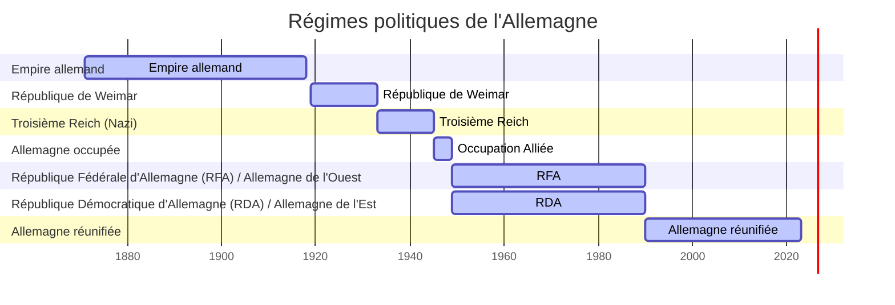
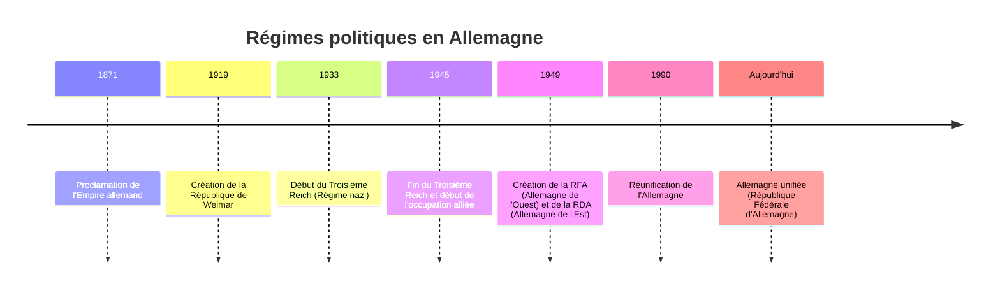

#séance2 

***Bibliographie :***
Thomas Hobbes, *Léviathan* (1651), Jean Bodin

***Contexte Historique :***
Le XVIIe siècle est marqué par une série de conflits et de bouleversements politiques en Europe. Parmi eux, la guerre de Trente Ans (1618-1648) a profondément marqué les États européens, dévastant de nombreuses régions, en particulier le Saint-Empire romain germanique. À la suite de ce conflit, le besoin d'un État fort et centralisé se fait sentir pour assurer la paix et la stabilité. 

C'est dans ce contexte que **Thomas Hobbes** écrit *Léviathan* en 1651, une œuvre qui propose une théorie de l'État moderne. Hobbes, influencé par les guerres civiles anglaises et les troubles politiques, considère que l'État doit être une autorité centrale forte pour éviter le "chaos naturel" (l'état de nature), où règne la loi du plus fort. Pour lui, les individus doivent renoncer à une partie de leur liberté en faveur d'un **contrat social**, afin de bénéficier de la sécurité offerte par l'État. L'État, comparé à un monstre biblique (le Léviathan), détient alors un pouvoir absolu pour garantir la paix et l'ordre.

**Jean Bodin**, quant à lui, est une autre figure clé de la réflexion sur l'État au XVIe siècle. Il développe la théorie de la **souveraineté**, selon laquelle le pouvoir suprême de l'État est indivisible et absolu. Pour Bodin, la souveraineté repose sur le monarque, qui détient le pouvoir législatif, exécutif et judiciaire, au-dessus des lois ordinaires. Sa pensée a inspiré les monarchies absolues, notamment celle de **Louis XIV** en France.

***Théories de l'État :***

1. **Thomas Hobbes et le contrat social** :
    - *Léviathan* (1651) présente l'État comme une réponse nécessaire au chaos de l'état de nature.
    - L'homme, dans son état naturel, vit dans une condition de guerre permanente, "la guerre de tous contre tous".
    - Pour éviter ce chaos, les individus passent un **contrat social**, déléguant leur pouvoir à un souverain tout-puissant (le Léviathan).
    - L'État devient ainsi un outil de **contrainte légitime** pour maintenir l'ordre et la paix, même au prix d'une forte centralisation du pouvoir.

2. **Jean Bodin et la souveraineté** :
    - Bodin est l'un des premiers théoriciens à formuler le concept de **souveraineté absolue**.
    - La souveraineté se manifeste par un pouvoir qui ne peut être remis en question ni divisé.
    - Il justifie la monarchie absolue comme modèle de gouvernement, où le roi est au-dessus de la loi, garant de l'unité de l'État.
    - Sa pensée a eu une influence profonde sur des monarques comme Louis XIV, qui a incarné l'idée d'un pouvoir centralisé et absolu avec la célèbre phrase : *L'État, c'est moi*.

***Conséquences :***

La consolidation de ces théories a marqué un tournant dans l'histoire politique de l'Europe. Le concept d'État centralisé, avec une souveraineté forte, devient le modèle dominant, renforcé par la montée des monarchies absolues. La pensée de Hobbes et Bodin a préparé le terrain pour l'apparition des États-nations modernes. Louis XIV, avec son règne de 72 ans, est devenu l'exemple emblématique de ce modèle de gouvernement, où l'État et le monarque ne font qu'un.

# Concept D'État

Karl Marx, sociologue et économiste, a évoqué le **droit romain** et la notion de **contrainte légitime**.

La décolonisation a mené à la création de 196 États dans le monde.

### Définition de l'ONU sur l'État

Un État est un **objet juridique**, **caractérisable**, disposant d'une **souveraineté** par un gouvernement sur un territoire donné, comprenant une population. Il entretient des liens avec d'autres États, et il est un **sujet de droit international**, ce qui signifie qu'il gère les relations entre les États.

### Parenthèse sur les régimes politique Allemand

### Société sans État : 4 particularités

- Pas de différence sociale marquée
- Pas de hiérarchie
- Les liens de parenté l'emportent sur le lien national

# Perspective Historique

## ***La naissance de l'Egypte pharaonique***

*Masque funéraire de toutenkamon* Musée du Caire 

***L'Egypte*** possède énormément d'or, ce qui à fait sa richesse historique. Notre histoire commence au **néolithique** désigne une histoire au cour de laquelle les populations nomades ce sont sédentarisées. Ces populations se sont mirent à cultiver la terre, exploité le bétail, tailler la pierre différemment pour créer parfois de véritable machine agricole.

La population égyptienne s'installa près du Nil avec certaines difficultés :
- Fleuve instable 
- Désert arride
- Manque d'arbre

Le Nil va être mis artificiellement en exploitation :
1. Créer des systèmes d'irrigations
2. Des greniers à grains

Compenser leurs faiblesses par une unité Egyptienne :
***3 Régions :*** 
- La Haute Egypte
- Moyenne Egypte
- Basse Egypte : sources de richesse : *papyrus*

Monarche Nilauthique : Localement compétente mais vite débordé.
Nécessite une véritable gestion des ressources, nécessite des politiques de grands travaux. Il faut donc centraliser pour les petites monarchie n'ayant pas les moyens. 

***Nagata III :*** début de l'Etat Egyptien pour les ressources, la gestion du Nil et le commerce.

L'Etat pharaonique n'a pas été créer, les conditions naturels, le travail et la force des hommes vont amené à s'unir. ***Cette Unions est le propre de l'Etat***.

*voir la palette de narmer* (objet de cosmétique)

couronne rouge haute Egypte ; couronne blache basse Egypte

-3150

---

## ***La cité démocratique d'Athène*** 
### I. La naissance de la démocratie athénienne

#### A. Les réformes de Clisthène (507 av. J.-C.)

La démocratie athénienne est née à la suite des réformes de **Clisthène**, un aristocrate qui, après une période de troubles politiques, introduit une série de réformes pour affaiblir le pouvoir des aristocrates et renforcer le pouvoir du peuple :

- **Démocratisation des institutions** : Clisthène divise le territoire en **dèmes** (circonscriptions locales) pour encourager la participation des citoyens à la vie publique.
- **Isonomie** : Il instaure le principe d’**égalité devant la loi**, permettant à chaque citoyen de participer à l'Assemblée et à la gestion des affaires publiques.
- **Bouleutérion (Conseil des 500)** : Ce conseil prépare les lois à voter par l’Assemblée et contrôle l'administration. Ses membres sont tirés au sort pour garantir une représentation égale.

#### B. L’héritage de Périclès (Ve siècle av. J.-C.)

Sous l’impulsion de **Périclès**, un homme d’État influent, la démocratie athénienne connaît son apogée. Périclès renforce l'importance de la participation citoyenne :

- **Misthophorie** : Il introduit le **salaire pour les magistrats et les citoyens** siégeant dans les tribunaux, permettant aux plus pauvres de participer aux affaires publiques.
- **Élargissement des droits politiques** : Périclès met l’accent sur l’importance de la culture politique et incite tous les citoyens à participer activement à la vie de la cité.

### II. Les institutions démocratiques d’Athènes

#### A. L'Ecclésia (Assemblée du peuple)

L'**Ecclésia** était l'organe central de la démocratie athénienne. Elle réunissait tous les citoyens, qui pouvaient y **voter les lois**, **élire les magistrats**, et **décider des grandes orientations politiques** (guerre, alliances, etc.).

- Participation : Tout citoyen mâle de plus de 18 ans avait le droit de participer, ce qui en faisait une démocratie directe.
- Compétences : L'Assemblée avait le pouvoir législatif et pouvait même contrôler l’exécutif.

#### B. La Boulè (Conseil des 500)

La **Boulè** préparait les décisions de l’Assemblée et veillait à leur application. Composée de 500 citoyens, tirés au sort parmi les dèmes, elle représentait la diversité géographique d’Athènes.

- Rôle législatif : La Boulè proposait les décrets et lois soumis à l’Assemblée.
- Fonction de contrôle : Elle contrôlait les magistrats et s'assurait de la bonne exécution des décisions votées par l’Ecclésia.

#### C. L’Héliée (Tribunal populaire)

L’**Héliée** était un tribunal composé de citoyens tirés au sort pour juger les affaires civiles et pénales. Il symbolisait l’idée que la justice devait être rendue par le peuple et non par une élite.

- Composition : 6 000 citoyens étaient tirés au sort chaque année pour composer ce tribunal.
- Pouvoir judiciaire : L’Héliée pouvait statuer sur des litiges entre citoyens, mais aussi juger les magistrats et annuler des lois inconstitutionnelles.

#### D. Les Magistrats (Archontes et Stratèges)

Les **magistrats** étaient élus ou tirés au sort pour une durée limitée. Ils étaient responsables de la gestion quotidienne de la cité :

- **Archontes** : Tirés au sort, ils étaient chargés des affaires religieuses, judiciaires, et administratives.
- **Stratèges** : Élus par l'Assemblée, les stratèges avaient des responsabilités militaires, mais aussi politiques, notamment en ce qui concerne la diplomatie et la gestion des affaires extérieures.

### III. Les principes fondamentaux de la démocratie athénienne

#### A. La participation directe des citoyens

Contrairement aux démocraties représentatives modernes, la démocratie athénienne était une **démocratie directe**, où les citoyens participaient personnellement à l'élaboration des lois et aux décisions publiques. Cette participation était considérée non seulement comme un droit, mais aussi comme un devoir civique.

#### B. L'égalité devant la loi (Isonomie)

L’**isonomie**, ou égalité devant la loi, était un principe central de la démocratie athénienne. Tous les citoyens avaient le même droit à participer à la vie publique, à voter, et à occuper des fonctions publiques. Cependant, il est important de souligner que cette égalité concernait uniquement les **citoyens masculins**, excluant ainsi les femmes, les métèques (étrangers résidents) et les esclaves.

#### C. Le tirage au sort comme garantie d’impartialité

Le **tirage au sort** était une caractéristique unique de la démocratie athénienne. Il servait à désigner les membres de nombreuses institutions, comme la Boulè et l’Héliée. Ce mécanisme visait à éviter la concentration du pouvoir dans les mains de quelques-uns et à garantir une rotation régulière des responsabilités politiques.

### IV. Limites de la démocratie athénienne

#### A. Exclusion d'une large partie de la population

La démocratie athénienne était très restreinte : seuls les citoyens mâles nés de parents athéniens pouvaient participer. Les **femmes**, les **esclaves**, et les **métèques** (étrangers) étaient exclus de la citoyenneté et donc de la vie politique. Cette limitation pose des questions sur la réelle dimension démocratique du système.

#### B. Les dangers de la démagogie

L’un des grands défis de la démocratie athénienne était la **démagogie**. Certains orateurs charismatiques pouvaient influencer les décisions de l’Assemblée en flattant le peuple ou en manipulant les émotions, ce qui pouvait conduire à des décisions impulsives ou désastreuses.

#### C. L’ostracisme

L’**ostracisme** était un mécanisme par lequel un citoyen jugé dangereux pour la démocratie pouvait être exilé pour une période de dix ans. Bien que cette mesure visait à protéger la cité contre les ambitions tyranniques, elle pouvait aussi être utilisée de manière abusive pour écarter des adversaires politiques.

---

## L'Etat de droit américain

### 1. Apparition de la population d'Amérique

- **Théorie du pont terrestre de Béring** : Selon cette théorie, les premières populations amérindiennes seraient arrivées en Amérique par un pont terrestre reliant l'Asie à l'Amérique du Nord pendant la dernière période glaciaire, il y a environ 15 000 à 30 000 ans.
- **1492** : Découverte de l'Amérique par **Christophe Colomb**, qui, bien qu'il ne soit pas le premier à atteindre le continent, marque le début d'un intérêt européen massif pour les terres du Nouveau Monde.

### 2. Nommer le continent

- Le continent est nommé **Amérique** en l'honneur d'**Amerigo Vespucci**, un explorateur italien qui a réalisé plusieurs voyages d'exploration et a été l'un des premiers à suggérer que les terres découvertes par Colomb ne faisaient pas partie des Indes, mais constituaient un nouveau continent.

### 3. Explorations et colonisations

- **Début des explorations** :
    - **France** : Jacques Cartier explore le Canada (1534-1542) et revendique des terres pour la France.
    - **Espagne** : Les conquistadors, tels que Hernán Cortés et Francisco Pizarro, conquièrent de vastes territoires en Amérique centrale et du Sud.
    - **Royaume-Uni** : Les premières tentatives de colonisation anglaise se font à Roanoke (1585) et Jamestown (1607), marquant le début de la colonisation anglaise en Amérique du Nord.

### 4. Les Pères pèlerins

- **Pères pèlerins** : En 1620, un groupe de colons anglais, appelés les Pères pèlerins, s'embarquent sur le **Mayflower** et s'installent à Plymouth, dans le Massachusetts. Ils fuient la persécution religieuse en Angleterre et cherchent à établir une communauté fondée sur leurs croyances puritaines.

### 5. Conflits et répercussions

- **1756** : Début de la **Grande Guerre de Sept Ans** (ou Guerre de la Conquête) qui oppose les forces britanniques et françaises en Amérique du Nord. Ce conflit a de graves répercussions, notamment la perte de l'empire colonial français en Amérique à l'issue du traité de Paris en 1763.
- **Conséquences économiques** : Après la guerre, le Royaume-Uni cherche à rembourser ses dettes en imposant de nouvelles taxes aux colonies américaines, provoquant le mécontentement.

### 6. Organisation des colonies

- En **1775**, les Treize colonies sont bien établies et gouvernées par des **gouverneurs** choisis par les grandes familles locales, accompagnés d'une **assemblée** législative composée de colons élus. Ces assemblées commencent à revendiquer de plus en plus d'autonomie face à l'autorité britannique.

### 7. Tensions avec la Grande-Bretagne

- **Stamp Act (1765)** : Ce texte impose une taxe sur tous les documents imprimés, provoquant une forte opposition dans les colonies, qui considèrent cela comme une violation de leurs droits.
- **Boston Tea Party (16 décembre 1773)** : En réponse à la **Tea Act** qui favorise la Compagnie anglaise des Indes orientales, des colons déguisés en Indiens jetent 342 caisses de thé à la mer à Boston, un acte symbolique de défi contre la domination britannique.

### 8. La route vers l'indépendance

- **1er Congrès continental (1774)** : Les représentants des colonies se réunissent à Philadelphie pour discuter des actions à entreprendre contre la Grande-Bretagne. Ils adoptent une déclaration des droits et de griefs.
- **2e Congrès continental (1775)** : Suite aux tensions croissantes et au déclenchement des hostilités (batailles de Lexington et Concord), ce congrès prend le contrôle de l'effort de guerre et commence à organiser une armée continentale dirigée par **George Washington**.
- **Déclaration d'indépendance (4 juillet 1776)** : Rédigée principalement par **Thomas Jefferson**, la déclaration proclame l'indépendance des colonies vis-à-vis de la Grande-Bretagne, affirmant les principes de liberté et d'égalité. Elle marque l'acte de naissance des États-Unis d'Amérique.

> [!PDF|] [[Déclaration Indépendance des Etats Unis.pdf#page=1&selection=8,0,51,62|Déclaration Indépendance des Etats Unis, p.1]]
> > Lorsque, dans le cours des événements humains, il devient nécessaire pour un peuple de dissoudre les liens politiques qui l'ont attaché à un autre et de prendre, parmi les puissances de la Terre, la place séparée et égale à laquelle les lois de la nature et du Dieu de la nature lui donnent droit, le respect dû à l'opinion de l'humanité oblige à déclarer les causes qui le déterminent à la séparation. Nous tenons pour évidentes pour elles-mêmes les vérités suivantes : tous les hommes sont créés égaux ; ils sont doués par le Créateur de certains droits inaliénables; parmi ces droits se trouvent la vie, la liberté et la recherche du bonheur. Les gouvernements sont établis parmi les hommes pour garantir ces droits, et leur juste pouvoir émane du consentement des gouvernés. Toutes les fois qu'une forme de gouvernement devient destructive de ce but, le peuple a le droit de la changer ou de l'abolir et d'établir un nouveau gouvernement, en le fondant sur les principes et en l'organisant en la forme qui lui paraîtront les plus propres à lui donner la sûreté et le bonheur. La prudence enseigne, à la vérité, que les gouvernements établis depuis longtemps ne doivent pas être changés pour des causes légères et passagères, et l'expérience de tous les temps a montré, e n effet, que les hommes sont plus disposés à tolérer des maux supportables qu'à se faire justice à eux-mêmes en abolissant les formes auxquelles ils sont accoutumés.

Le premier drapeau américain, souvent connu sous le nom de « Grand Union Flag », a été adopté en 1775 pendant la Révolution américaine. Ce drapeau se caractérise par treize bandes horizontales rouges et blanches, représentant les Treize colonies américaines qui se sont rebellées contre la couronne britannique. Dans le coin supérieur gauche, il y avait l'Union Jack britannique, symbolisant les origines coloniales des États-Unis à l'époque

Besty Rose flag.

La bataille de Yorktown est souvent considérée comme le tournant décisif de la Révolution américaine. Elle a eu lieu du 28 septembre au 19 octobre 1781 et a conduit à la capitulation des forces britanniques sous le commandement du général Cornwallis.

- **Alliance avec les Français** : Benjamin Franklin, en tant que diplomate américain, a joué un rôle crucial dans l'établissement d'une alliance stratégique avec la France en 1778. Cette alliance a apporté un soutien militaire et financier vital aux colonies. À Yorktown, les forces américaines, dirigées par le général George Washington, ont été soutenues par une flotte française sous le commandement de l'amiral de Grasse, ainsi que par des troupes terrestres françaises.
- **Conséquences de la bataille** : La défaite britannique à Yorktown a conduit à des négociations de paix et a finalement contribué à la signature du traité de Paris en 1783, qui a reconnu l'indépendance des États-Unis. Cela a marqué le début de la fin du pouvoir colonial britannique en Amérique du Nord. **Traité de Paris 3 septembre 1783***

#histoire-du-droit 