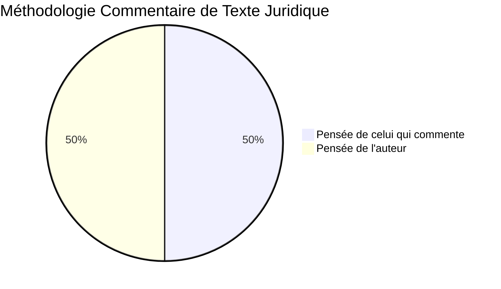

C'est un ***examen / critique*** du ou des sens d'un texte en vue d'en ***faciliter / approfondir*** la compréhension et l'interprétation

***Le texte à commenter est au coeur de l'exercice***. Il est important de réfléchir autour de l'idée ou des grandes idées du texte

Ce n'est pas une paraphrase du texte.=> ***Conaissance extérieures indispensables***.

Même présentation formelle que la dissertation

***CITER - EXPLIQUER - ANALYSER***
