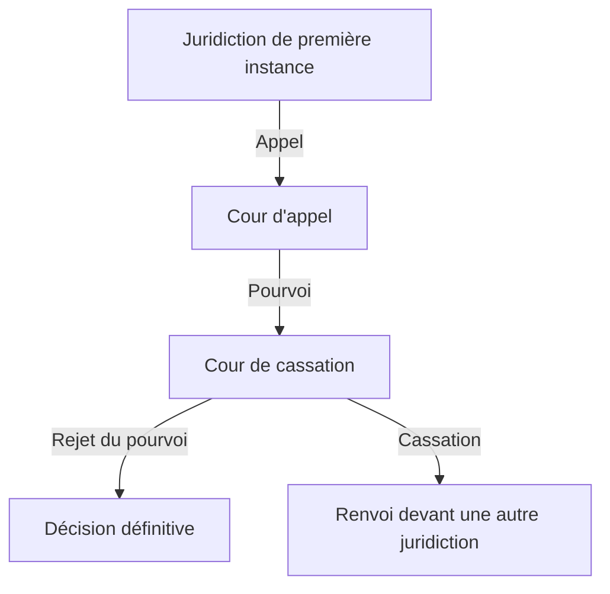

#fiche #institutions-juridictionnelles 
## Définition
La **Cour de cassation** est la plus haute juridiction de l'ordre judiciaire en France. Son rôle principal est de **vérifier la conformité des décisions des tribunaux et cours d'appel avec la loi**. Elle ne rejuge pas les faits, mais contrôle la correcte application du droit.

---

## Organisation de la Cour de cassation

### Composition
- **Premier président** : Il dirige la Cour de cassation.
- **Chambres** :
  - 6 chambres au total :
    - **3 chambres civiles**
    - **1 chambre commerciale**
    - **1 chambre sociale**
    - **1 chambre criminelle**
- Chaque chambre est composée de **conseillers** et est présidée par un président de chambre.

### Siège
- La Cour de cassation siège au **Palais de Justice de Paris**.

---

## Compétence de la Cour de cassation

### 1. **Compétence générale**
- La Cour de cassation est saisie par la voie du **pourvoi en cassation**.
- Elle ne rejuge pas les faits, mais contrôle que les règles de droit ont bien été appliquées par les juridictions inférieures.

### 2. **Rôle du pourvoi**
- Le pourvoi en cassation peut être formé contre les arrêts des **cours d'appel** et les jugements rendus en premier et dernier ressort par les **tribunaux**.
- Le pourvoi est **limité aux questions de droit**.

---

## Procédure devant la Cour de cassation

### 1. **Délais pour former un pourvoi**
- Le délai pour former un pourvoi est généralement de **2 mois** à partir de la notification du jugement ou de l'arrêt.

### 2. **Particularités de la procédure**
- **Caractère non suspensif** : La décision attaquée reste applicable tant que la Cour de cassation n'a pas statué.
- Les **avocats aux Conseils** sont les seuls habilités à plaider devant la Cour de cassation.

### 3. **Rôle de l’avocat général**
- L'avocat général donne un avis sur les affaires, mais ne représente aucune des parties.

---

## Décisions de la Cour de cassation

### 1. **Rejet du pourvoi**
- Si la Cour de cassation estime que la loi a été correctement appliquée, elle **rejette le pourvoi**.
- La décision attaquée devient alors **définitive**.

### 2. **Cassation de l'arrêt ou du jugement**
- Si la Cour de cassation estime que la loi a été mal appliquée, elle **casse et annule** la décision attaquée.
- Elle peut renvoyer l'affaire devant une autre juridiction pour être rejugée (**cassation avec renvoi**), ou dans certains cas, casser sans renvoi.

---

## Références légales

- **Articles 604 à 639 du Code de procédure civile** (France).
- **Articles 567 à 583 du Code de procédure pénale** (France).
  
---

## Schéma récapitulatif

#fiche #institutions-juridictionnelles 