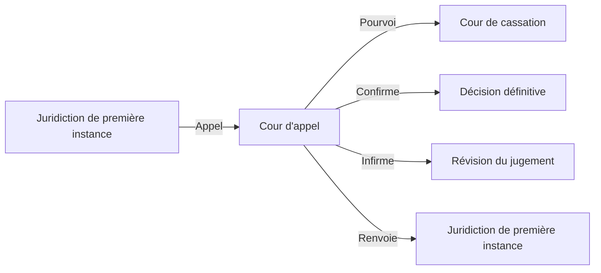

## Définition
La **cour d'appel** est une juridiction du **deuxième degré** dans le système judiciaire. Elle permet de rejuger une affaire déjà tranchée en première instance par une juridiction civile, pénale ou administrative. Les décisions rendues en première instance peuvent être contestées devant la cour d’appel si l’une des parties n'est pas satisfaite du jugement.

---

## Organisation de la cour d'appel

### Composition
- **Président de la cour d'appel** : Il dirige la cour et coordonne les chambres.
- **Chambres** : Chaque cour d’appel est divisée en plusieurs chambres spécialisées, comme la chambre civile, commerciale, sociale, ou encore pénale.
- **Conseillers** : Les juges des cours d'appel sont appelés conseillers.

### Sièges
- La cour d'appel siège dans chaque **région judiciaire**.
- Chaque cour d’appel peut avoir une ou plusieurs **chambres** selon le volume des affaires.

---

## Compétence de la cour d'appel

### 1. **Compétence en matière civile**
- Les appels des décisions rendues par les **tribunaux judiciaires** ou les **tribunaux de commerce**.
- Les appels des jugements concernant le droit de la famille, les litiges commerciaux, les conflits locatifs, etc.

### 2. **Compétence en matière pénale**
- Les appels des jugements des **tribunaux correctionnels** et des **tribunaux de police**.
- En matière criminelle, la cour d'appel statue comme cour d’assises d'appel.

### 3. **Compétence en matière sociale**
- Les appels des décisions rendues par les **conseils de prud’hommes** (litiges entre employeurs et salariés).
  
### 4. **Compétence administrative (cour administrative d'appel)**
- Juge en appel des décisions rendues par les **tribunaux administratifs**.

---

## Procédure devant la cour d'appel

### 1. **Délais d'appel**
- **Délai général** : 1 mois après le jugement de première instance.
- **Délai en matière pénale** : Généralement 10 jours.

### 2. **Effet de l'appel**
- **Effet suspensif** : Le jugement initial n’est pas appliqué tant que la cour d’appel n’a pas rendu sa décision (sauf dans certains cas particuliers).
- **Effet dévolutif** : La cour d'appel réexamine l'affaire dans son ensemble, tant sur les faits que sur le droit.

### 3. **Rôle des parties**
- Les parties doivent **réitérer leurs arguments** ou en formuler de nouveaux.
- La procédure peut être **écrite** ou **orale**, selon le type de contentieux.

---

## Décisions de la cour d'appel

### 1. **Confirmation**
- La cour d'appel peut **confirmer** le jugement de première instance si elle considère qu'il est bien fondé.

### 2. **Infirmer**
- Elle peut **infirmer** (modifier) le jugement, en tout ou en partie.

### 3. **Renvoi** 
- Dans certains cas, la cour d'appel peut décider de **renvoyer l'affaire** devant une juridiction de première instance.

---

## Pourvoi en cassation

- Si l’une des parties n’est pas satisfaite du jugement rendu en appel, elle peut former un **pourvoi en cassation**.
- La Cour de cassation **ne juge pas les faits**, mais contrôle la correcte application du droit.

---

## Références légales

- **Articles 542 à 583 du Code de procédure civile** (France).
- **Articles 505 à 521 du Code de procédure pénale** (France).

---

## Schéma récapitulatif

#fiche #institutions-juridictionnelles 

